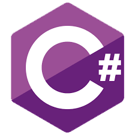

# Привет! :raising_hand_man:

Меня зовут Сергей, я инженер-программист

## Используемый мной стек:

### Языки программирования, фреймворки:

      
 
 

### Технологии:

- Android SDK;
- Workmanager;
- CameraX;
- Navigation Component, Cicerone, Fragment transaction;
- Glide, Picasso, Coil;
- Jetpack Compose (MVVM, MVI);
- Kotlin coroutines, Flow;
- Lifecycle-Aware Components;
- Hilt (Dagger2), Koin, Kodein;
- Room, Jetbrains Exposed, SQLDelight;
- OkHttp3, Retrofit, Ktor, Gson, Moshi, kotlinx serialization;
- Mapbox SDK v9/v10;
- Firebase;
- Custom View / Canvas drawing (Compose)
- RegEx;
- Figma.

### Выполняемые роли на проектах:

- Проектирование архитектуры;
- Проектирование баз данных для информационных систем;
- Реализация различного функционала;
- Дизайн экранов приложения;
- Консультация молодых специалистов;
- проведение технических интервью;

### Направления проектов:

- карты, рисование на картах;
- агросопровождение;
- прикладная математика;
- пилотирование Цифрового рубля (Финтех);
- участие в реализации функционала лотерей SattyZhuldyz (Казахстан).

### Мой стаж:

декабрь 2017 - июль 2021 → ВС РФ (информационный профиль)

август 2021 - январь 2023 → AO "A 201" (Бионоватик)

февраль 2023 - н.в. → ООО Спайдер Груп.
